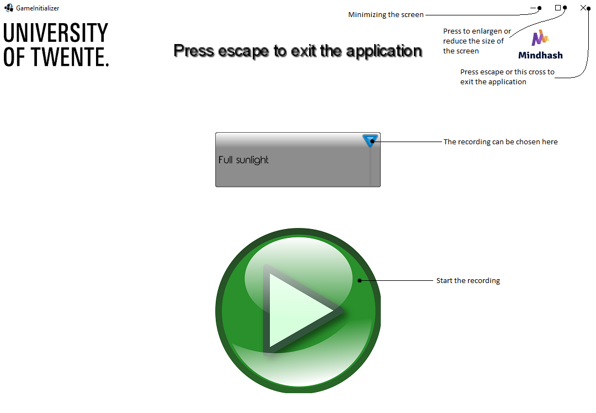
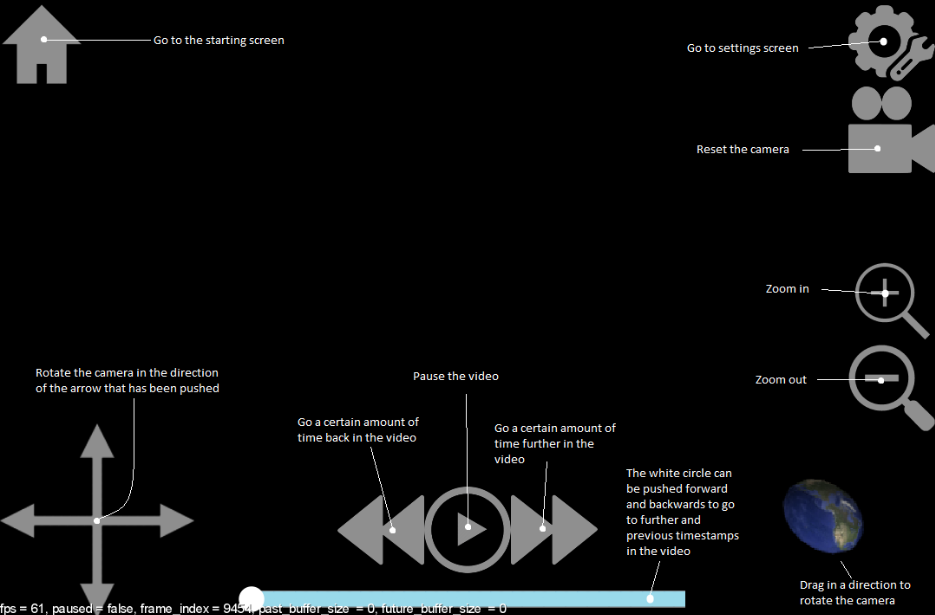

# Manual for LiDAR touch table visualization

Team Quokka: Till Pinke, Robert Banu, Gibson Vredeveld, Stan Peters

## Introduction

LiDAR Table Visualization is an application used for viewing point clouds generated by LiDAR cameras.
It was created through a collaboration between Mindhash, University of Twente and team Quokka.  
The LiDAR application consists of three screens: the starting screen, the recording screen and the settings screen.
The **starting screen** is the first screen that you will see after starting the application.
On this screen users can select pre recorded data or upload their own.
The next screen follows after the selection of data and it is the **recording screen** which will show the selected recorded data.
Within this screen users can open a third and final screen, the **settings screen**, where the settings of the application can be changed.
How these screens work will be further explained in the rest of this manual.

## Starting Screen

When the application is opened, it starts with the **Starting Screen** (figure 1).
The screen contains a drop down menu giving a choice to you to select one of the pre recorded data sets.  
After selecting one of the recordings or uploading your own data , you can press the big green button which will start the main screen of the application.
While in the Starting Screen, it is possible to close the application by pressing Esc on the keyboard or by closing the Windows window.

## Recording Screen

The Recording Screen is the main screen of the application.
Here the data is rendered you have full control of the camera to look around and observe the data.  
There are also a lot of buttons on the screen:

- The **Home** button on the top left of the screen brings you to the starting screen, from which you can switch the data in the environment or exit the application.
- The four-pointed **Arrow**, situated in the bottom left corner of the screen, is used to move the camera in the environment.
  It moves the camera up, down, left or right.
- The **Slider**, in the bottom middle of the screen, is alike a progression bar of a YouTube video.
  It indicates where in the stream the current displayed data is.
  It can be moved to skim-through the datastream.
- The **Play/Pause** button does exactly what you would expect, it pauses the stream when it is playing and it plays the stream when it is paused.
- The **Two arrows** that are pointed to the left can be pushed to skip 4 seconds backwards.
- The **Two arrows** that are pointed to the right can be pushed to skip 4 seconds forwards.
- The **Earth** button can be pulled to _rotate_ the camera in an intuitive way. Simply click on the button and drag to move the camera.
- The **Magnifier** glass with the **minus** inside, situated in the far right of the screen, can be used to move the camera _backwards_.
  It could also be thought of as zooming out.
- The **Magnifier** glass with the **plus**, situated in the far right of the screen, inside can be used to move the camera _forwards_.
  It could also be thought of as zooming in.
- The _Gear and Wrench_ occupying the top right corner of the screen is the **Settings**, which when pressed will open the setting menu
- The **Camera** button, found in the top right corner, just below the setting button, is a camera reset.
  When pressed, the camera will be moved at the starting position in the environment.

## Settings Screen

The setting screen is where you are able to change the setting of the application.
Many things can be changed here, from compression level to available memory.
When the screen is opened, the stream is paused and unpaused when the screen is closed.  
Settings have to be saved first before being applied, so do not forget to press the Save button before going back to the main screen.  
All the settings are saved when the program is closed, so when you start up the program, it will initialize with the most recent settings.  
The available settings are summarised below, in order of appearance from the top to the bottom of the settings screen:

- **LiDAR FPS**
  This setting changes the playback speed of the data coming in.
  The default LiDAR data is ten frames per second.
  The other two choices for this setting are 20, which would lead to the data being displayed at twice the speed, and 5, consequently making the data be displayed at half the generated rate.
- **Memory**
  Determines the buffer size in seconds for skipping forwards and backwards in.
  This may be limited due to memory limitations on the device.
- **Resolution**
  Changes the resolution of the program. You can choose between 1920x1080 , 1280x720 and Fullscreen.
- **Fixed Camera**
  If this checkbox is checked, then the camera is set to always look at the Origin of the environment.
  If it is not selected, then you are able to freely rotate the camera.
- **Automatic Camera**
  If this button is toggled on, the camera’s direction will be fixed in the center, just like with the Fixed Camera setting, but it will also slowly rotate around the Origin.
  This is for the purpose of presentations.  
  Note that enabling either automatic or fixed camera enables the fixed camera as well.
  To regain free camera control both settings need to be disabled.
- **The Compression level**
  A drop down list with the choices of 1,4, 3 and 2. 1 being no compression applied to the data.
  The other levels of compression, in order of fidelity, 4, 3 and 2.
  Meaning, level 4 has the most fidelity to the data and level 2 the least.
  The less fidelity, the better performance generally.
- **Distance**
  If the Compression of data is turned on (compression is set to 2,3 or 4) and the Gradual Compression setting is checked then the level of compression of a point is decided based on its distance from the camera. The closer a point is , the less compressed it is.
  The closest points to the camera, in a distance smaller than the set Distance, are not compressed at all.
- **Rotate**
  This setting flips the screen 180 degrees.
  This feature is set for use specifically for the touch table.
- **GPS Model**
  This setting toggles the presance of the GPS model. The LiDAR cameras come with GPS coodrinates =
  This feature is set for use specifically for the touch table.

## Hotkeys

Bindings for hotkeys when the program is used with a keyboard.

| Function            | Hotkey     |
| ------------------- | ---------- |
| Home                | Esc        |
| Pause/Play          | Space      |
| Change compression  | 1, 2, 3, 4 |
| Switch gradual compression  | C  |
| Toggle fixed camera | L          |
| Toggle auto camera  | K          |
| Skip backward       | , <        |
| Skip forward        | . >        |
| Hide Hood           | H       |
| Hide GPS Model           | M       |

Bindings for free camera only:

| Function        | Hotkey                |
| --------------- | --------------------- |
| Rotate          | WASD                  |
| Roll left/right | Q, E                  |
| Pan             | Arrow keys            |
| Zoom            | R zoom in, F zoom out |
| Reset Camera    | X                     |

Bindings for fixed/automatic camera only:

| Function | Hotkey                    |
| -------- | ------------------------- |
| Move     | WASD                      |
| Zoom     | UP zoom in, DOWN zoom out |
